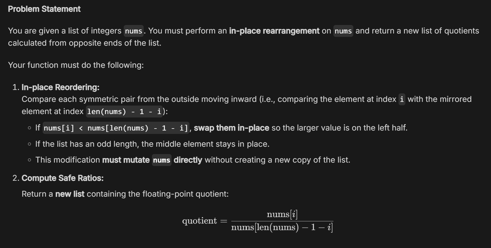
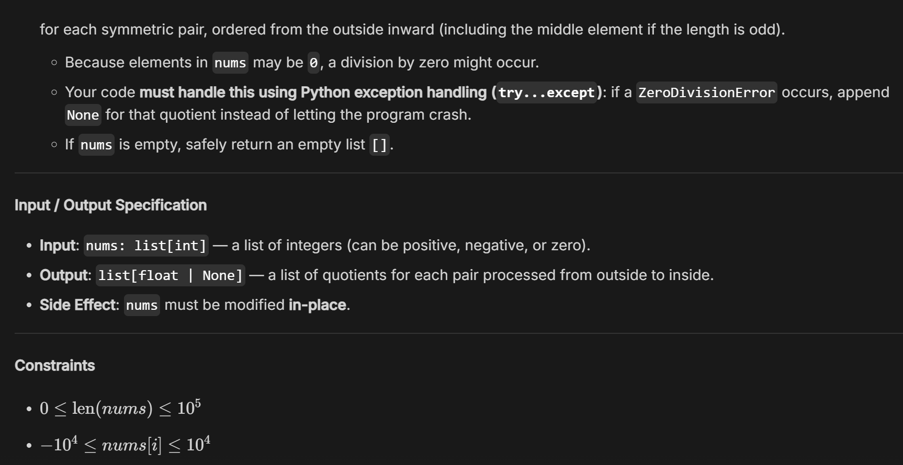

Name: 黃柏誠

Date: 2026/9/22

Topic: list, pytest

# 1. Today’s Challenge

## Core concept from today’s OCW lecture

list, pytest

## AI-generated coding challenge title

Symmetric Pair Normalizer

# 2. My Initial Approach — Before AI Help

Before asking AI for hints, briefly describe how you planned to solve the problem.

## My approach

Create an empty list `res` to store the result.

Iterate `i` from `0` to `len(nums) // 2`, swap `nums[i]` and `nums[len(nums) - i - 1]` if the former is smaller than the latter. Then check if `nums[len(nums) - i - 1]` equals `0`. If so, append `None` to `res`. If not, append `nums[i] / nums[len(nums) - i - 1]` to `res.

# 3. AI Tutor Help

Did you ask the AI Tutor for help?

■ No — I solved it independently

☐ Yes — I received one or more hints

## The most useful hint/question from AI was

Use try...except instead of if.

## It helped me realize that

Python error handling is useful.

# 4. My Revision

Did you change your approach or code after interacting with AI?

☐ No

■ Yes

## What did you change, and why?

Change `if nums[len(nums) - i - 1] == 0` to `try...expect ZeroDivisionError`. Since this is what the problem ask.

# 5. Verification

## My final program

■ Passed the provided examples

■ Passed additional edge cases

☐ Still has unresolved problems

## One edge case I tested

Input: 3 0 3

Expected output: [1.0, None]

Actual output: [1.0, None]

# 6. One-Minute Reflection

## What idea from the OCW lecture did you transfer to this new problem?

rev_list in lecture code.

## One thing I understand better now

How to use try...expect.

## One thing I am still unsure about

No.