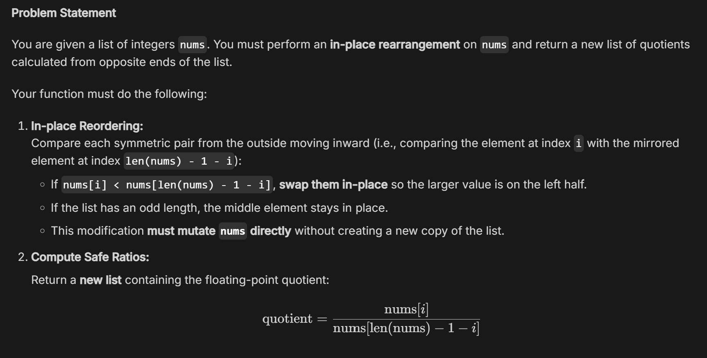
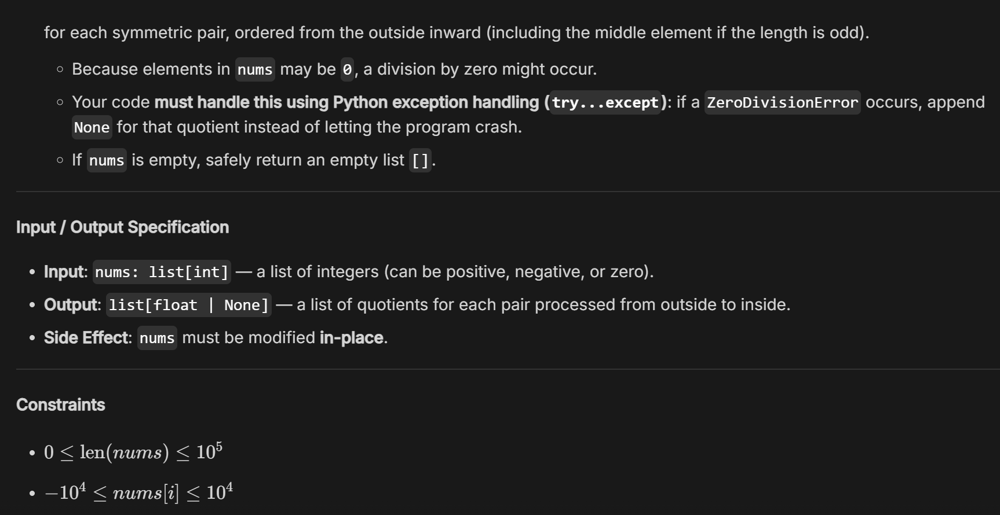

# Part A

Topic: pytest

Date: 2026/9/22

## ① Check My Understanding

Questions completed: 4 / 5

Answers revised after AI hints: 1 / 5

## ② My Misconception

### Before: I thought…

Pytest would report failed to functions with no assert.

### Now: I understand…

Pytest only fails when assert something false.

## ③ Challenge the AI

### One AI-generated question I challenged

Suppose you have two tests, test_a() and test_b(). When you run the whole test suite, both pass. However, when you run test_b() completely by itself in isolation, it fails.
This behavior proves that test_b() has a flaw, but guarantees that test_a() is properly isolated and free of side effects.

### Why?

■ Ambiguous

☐ Oversimplified

☐ Technically questionable

☐ Too easy

☐ Other: __________

### Brief explanation

Not sure what to answer if the first statement is true while the second is false.

## ④ One-Minute Reflection

### One thing I am still unsure about:

If one test function modifies a global variable, how to let pytest automatically revert that global variable back to its initial state before executing the next test function.

# Part B

Name: 黃柏誠

Date: 2026/9/22

Topic: list, pytest

## 1. Today’s Challenge

### Core concept from today’s OCW lecture

list, pytest

### AI-generated coding challenge title

Symmetric Pair Normalizer

## 2. My Initial Approach — Before AI Help

Before asking AI for hints, briefly describe how you planned to solve the problem.

### My approach

Create an empty list `res` to store the result.

Iterate `i` from `0` to `len(nums) // 2`, swap `nums[i]` and `nums[len(nums) - i - 1]` if the former is smaller than the latter. Then check if `nums[len(nums) - i - 1]` equals `0`. If so, append `None` to `res`. If not, append `nums[i] / nums[len(nums) - i - 1]` to `res.

## 3. AI Tutor Help

Did you ask the AI Tutor for help?

■ No — I solved it independently

☐ Yes — I received one or more hints

### The most useful hint/question from AI was

Use try...except instead of if.

### It helped me realize that

Python error handling is useful.

## 4. My Revision

Did you change your approach or code after interacting with AI?

☐ No

■ Yes

### What did you change, and why?

Change `if nums[len(nums) - i - 1] == 0` to `try...expect ZeroDivisionError`. Since this is what the problem ask.

## 5. Verification

### My final program

■ Passed the provided examples

■ Passed additional edge cases

☐ Still has unresolved problems

### One edge case I tested

Input: 3 0 3

Expected output: [1.0, None]

Actual output: [1.0, None]

## 6. One-Minute Reflection

### What idea from the OCW lecture did you transfer to this new problem?

rev_list in lecture code.

### One thing I understand better now

How to use try...expect.

### One thing I am still unsure about

No.