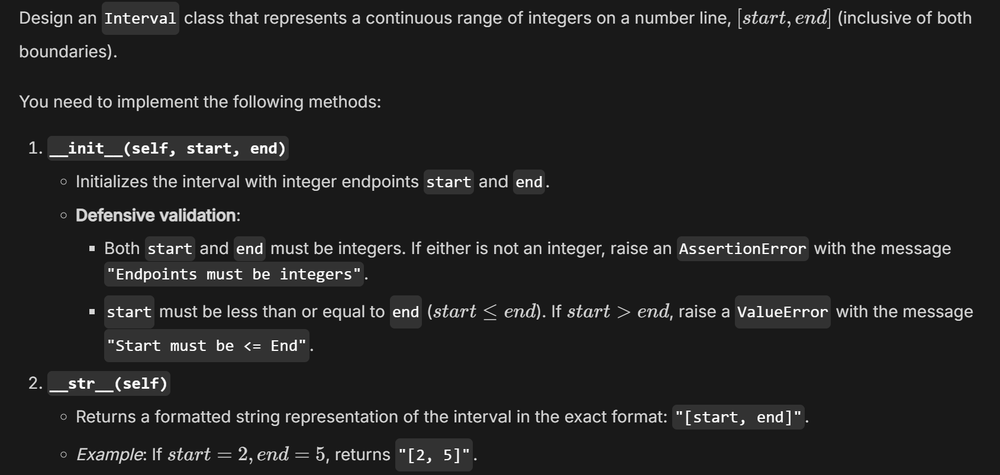
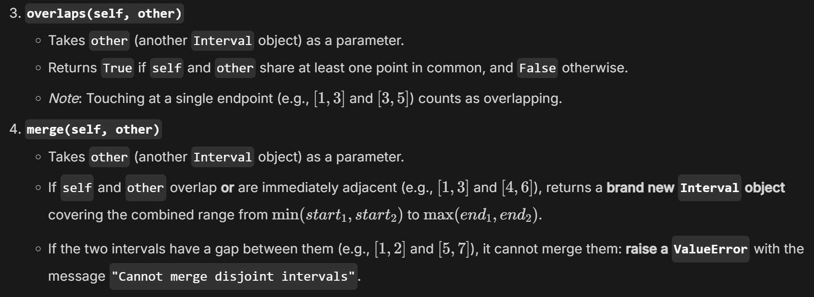

# Part A
Topic: Object oriented programming

Date: 2026/10/5
## ① Check My Understanding

Questions completed: 3 / 5

Answers revised after AI hints: 2 / 5

## ② My Misconception
### Before: I thought…

Should inheritance from "HAS-A" relationships.

### Now: I understand…

Model "HAS-A" relationships with composition (attributes), reserving inheritance strictly for true "IS-A" relationships.

## ③ Challenge the AI

### One AI-generated question I challenged

No, all are fine.
⸻

## ④ One-Minute Reflection

### One thing I am still unsure about:

I'm still not sure about when it's neccessary for a function to check the type of a passed-in object.

# Part B

Name: 黃柏誠

Date: 2026/10/5

Topic: OOP

## 1. Today’s Challenge

### Core concept from today’s OCW lecture

OOP, python class

### AI-generated coding challenge title

Design an Interval Class

## 2. My Initial Approach — Before AI Help

Before asking AI for hints, briefly describe how you planned to solve the problem.

### My approach

Straightly create a class `Interval` and implement the functions. In `overlaps` use if statement; in `merge` use raise ValueError.

## 3. AI Tutor Help

Did you ask the AI Tutor for help?

■ No — I solved it independently

☐ Yes — I received one or more hints

### The most useful hint/question from AI was

I didn't ask for a hint.

## 4. My Revision

Did you change your approach or code after interacting with AI?

■ No

☐ Yes

## 5. Verification

### My final program

■ Passed the provided examples

■ Passed additional edge cases

☐ Still has unresolved problems

### One edge case I tested

Input: `[1, 3].merge([4, 6])`

Expected output: `[1, 6]`

Actual output: `[1, 6]`

## 6. One-Minute Reflection

### What idea from the OCW lecture did you transfer to this new problem?

Implementing class fraction.

### One thing I understand better now

How to implement python class.

### One thing I am still unsure about

Can I call `i1.merge(i2.merge(i3))`?